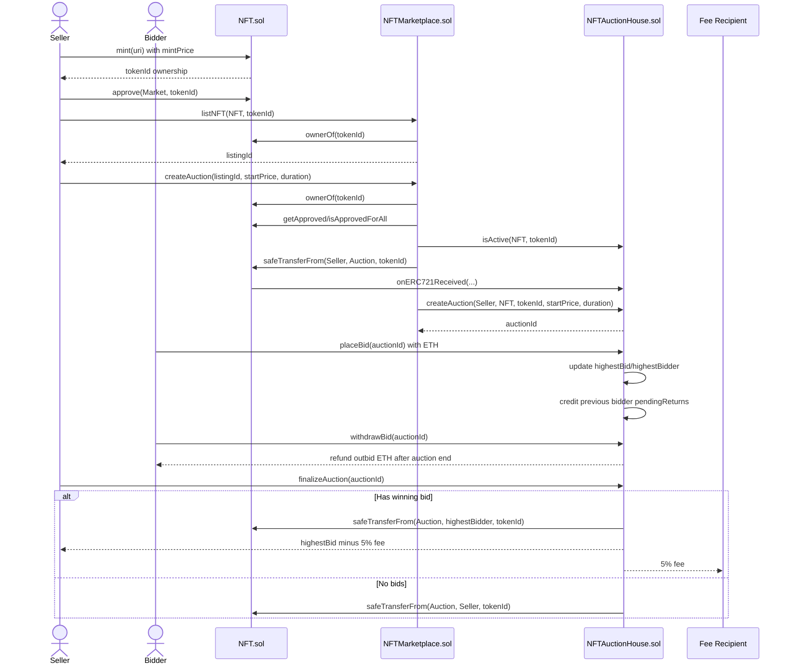
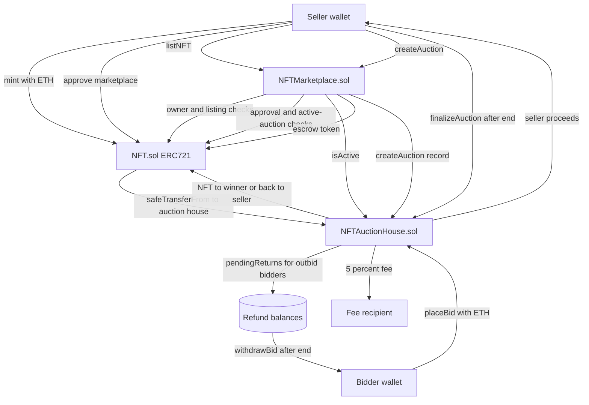

# NFT Auction Marketplace

## 📌 Overview

This project implements a decentralized NFT auction marketplace using the Hardhat development framework. It enables users to create, bid on, and settle NFT auctions while integrating real-time price data and upgradeable smart contract architecture.

---

## 🎯 Objectives

* Build a fully functional NFT auction marketplace
* Integrate on-chain price feeds to convert ERC20 and ETH values to USD
* Implement upgradeable smart contracts using proxy patterns

---

## 🛠️ Tech Stack

* **Smart Contracts:** Solidity
* **Development Framework:** Hardhat
* **Token Standards:** ERC-721 (NFT), ERC-20
* **Oracle Integration:** Chainlink Price Feeds
* **Upgradeability:** UUPS / Transparent Proxy Pattern

---

## ⚙️ Features

### 🖼️ NFT Auction

* Create auctions for ERC-721 tokens
* Set starting price, duration, and accepted payment token (ETH or ERC20)
* Transfer NFT ownership to the contract during auction

### 💰 Bidding System

* Place bids using ETH or supported ERC20 tokens
* Enforce minimum bid increments
* Automatically track highest bidder and bid amount
* Refund previous bidders when outbid

### ⏱️ Auction Settlement

* Automatically finalize auction after expiration
* Transfer NFT to the highest bidder
* Transfer funds to the seller

### 💵 USD Price Conversion

* Use Chainlink Data Feeds to fetch real-time price data
* Convert ETH and ERC20 bids into USD equivalent
* Improve transparency and comparability of bids

### 🔄 Upgradeable Contracts

* Implement upgradeability using:

  * **UUPS Proxy Pattern**, or
  * **Transparent Proxy Pattern**
* Enable logic upgrades without redeploying storage
* Ensure storage layout compatibility

---

## 🧱 Project Structure

```
contracts/
├── NFT.sol                # ERC721 token
├── NFTAuctionHouse.sol    # Core auction logic
├── NFTMarketplace.sol     # NFT listing
scripts/
├── deploy.ts              # Deployment script
├── mint.ts                # Mint NFT script
├── approve.ts             # Approve the marketplace to transfer the NFT
├── list.ts                # List NFT script
├── createAuction.ts       # Create aunction for listed NFT script
├── bid.ts/multiBid.ts     # bid script
├── finalizeAuction.ts     # End aunction script
├── withdraw.ts            # Refund script
test/
├── auction.test.ts        # Unit tests
hardhat.config.ts
frontend
backend
```

---

## Contract Review

### Current Contract Roles

* `NFT.sol` is the ERC-721 collection contract. Users mint `GopherNFT` tokens by paying `mintPrice`, the owner can update the mint price, and mint proceeds can be withdrawn by the contract owner.
* `NFTMarketplace.sol` is the user-facing listing/orchestration contract. It records active listings, checks NFT ownership, checks marketplace approval, transfers listed NFTs into the auction house, and asks the auction house to create the auction record.
* `NFTAuctionHouse.sol` is the auction escrow and settlement contract. It stores auction state, receives escrowed ERC-721 tokens, accepts ETH bids, tracks refundable outbid balances, finalizes auctions, transfers NFTs to winners, and pays seller proceeds plus the protocol fee.

### Important Findings

* `NFTAuctionHouse.createAuction` is externally callable by anyone and trusts the supplied `seller`, `nftContract`, and `tokenId`. Because it does not verify that the NFT was actually escrowed by the auction house, a direct caller can create fake active auctions, block legitimate auctions through `activeAuctions`, and potentially trap bidder ETH in auctions that cannot finalize.
* `NFTMarketplace.createAuction` does not mark the listing inactive or clear `activeListings` after moving the NFT into the auction house. This leaves stale active listings after auction creation and can prevent normal relisting of the same token later.
* `NFTAuctionHouse.finalizeAuction` can only be called by the seller. If the seller disappears or refuses to finalize, the winner cannot claim the NFT and the seller/fee payout path never executes.
* Outbid funds use a pull-payment model, which is good for avoiding forced ETH sends during bidding, but `withdrawBid` only allows withdrawal after the auction has ended. Outbid bidders cannot recover funds while the auction is still active.
* The current contracts are ETH-only and constructor-based. ERC20 bidding, Chainlink price conversion, and upgradeable proxy support are described in the roadmap/overview but are not implemented in the current Solidity files.

### Suggested Fix Direction

* Restrict `NFTAuctionHouse.createAuction` so only the marketplace can call it, or make the auction house verify `IERC721(nftContract).ownerOf(tokenId) == address(this)` before creating the auction.
* In `NFTMarketplace.createAuction`, deactivate the consumed listing and clear `activeListings[nftContract][tokenId]` once the NFT has been escrowed.
* Allow anyone to finalize an ended auction, or at least allow the winner to finalize after the end time.
* Consider letting outbid bidders withdraw as soon as they are outbid.
* Add tests for direct auction creation, stale listing lifecycle, winner finalization, no-bid finalization, fee payout, and bidder refunds.

---

## Contract Data Flow





---

## 🚀 Getting Started

### 1. Install Dependencies

```bash
npm install
```

### 2. Compile Contracts

```bash
npx hardhat compile
```

### 3. Run Tests

```bash
npx hardhat test
```

### 4. Deploy Contracts

```bash
npx hardhat node # start a local node, you can start sepolia testnet as well
npx hardhat run scripts/deploy.ts --network <network>
```

### 5. Interaction
```bash
npx hardhat run scripts/mint.ts --network <network>
npx hardhat run scripts/approve.ts --network <network> # approve NFT ownership so auction house can receive the NFT
npx hardhat run scripts/list.ts --network <network> # lising on marketplace 
npx hardhat run scripts/createAuction.ts --network <network>
npx hardhat run scripts/multiBid.ts --network <network> or npx hardhat run scripts/bid.ts --network <network>
npx hardhat run scripts/finalizeAuction.ts --network <network> # must wait until deadline reached
npx hardhat run scripts/withdraw.ts --network <network>
```
### 6. Full stack workflow
```bash
# 1. Start a local Ethereum development node (Hardhat)
npx hardhat node

# 2. Deploy contracts to the local network
npx hardhat run scripts/deploy.ts --network localhost

# 3. Launch the frontend (serves static files on a local server)
npx serve .

# 4. Start the backend API (Go server)
cd backend
go run main.go
```

### 7. Update in-memory storage to DB
- install gorm and mysql driver
```bash
cd backend
go get -u gorm.io/gorm
go get -u gorm.io/driver/mysql
```
- define models, repositories
```
backend
|__models
|__repository
```
- install and set up MySQL
```bash
sudo apt install mysql-server
sudo systemctl start mysql
# open MySQL CLI
sudo mysql
# create table, user and password
mysql > CREATE USER 'user'@'%' IDENTIFIED BY 'password';
mysql > GRANT ALL PRIVILEGES ON nft_marketplace.* TO 'user'@'%';
mysql > FLUSH PRIVILEGES;
```
- connect DB
```
dsn := "user:password@tcp(127.0.0.1:3306)/nft_marketplace?charset=utf8mb4&parseTime=True&loc=Local"

DB, err := gorm.Open(mysql.Open(dsn), &gorm.Config{})
if err != nil {
  log.Fatal(err)
}

// Auto migrate tables
err = DB.AutoMigrate(&models.Listing{}, &models.Auction{}, &models.Bid{})
if err != nil {
  log.Fatal(err)
}
```
- update in-memory data manipulation
```Go
// store.Auctions[auctionId.Uint64()] = store.Auction{
// 	ID:          auctionId.Uint64(),
// 	Seller:      seller.Hex(),
// 	NftContract: nftContract.Hex(),
// 	TokenId:     data.TokenId.String(),
// 	StartPrice:  data.StartPrice.String(),
// 	EndTime:     data.EndTime.Uint64(),
// 	Active:      true,
// }
err = repository.CreateAuction(&models.Auction{
  Seller:      seller.Hex(),
  NftContract: nftContract.Hex(),
  TokenId:     data.TokenId.String(),
  StartPrice:  data.StartPrice.String(),
  EndTime:     data.EndTime.Uint64(),
  Active:      true,
})
```
---

## 🔌 Chainlink Integration (To Do)

* Fetch ETH/USD price from Chainlink Aggregator
* Optionally fetch ERC20/USD if supported
* Normalize decimals for accurate conversion

---

## 🔐 Security Considerations

* Reentrancy protection on bid and withdraw functions
* Proper access control for upgrades
* Validation of auction parameters
* Safe handling of ERC20 transfers

---

## 📈 Future Improvements

* Support for multiple concurrent auctions per user
* Frontend UI framework integration (React + ethers.js)
* Off-chain indexing (e.g., The Graph)
* Gas optimization and batching

---

## 📄 License

MIT License

---

## 🙌 Acknowledgements

* Hardhat for development tooling
* Chainlink for decentralized oracle services
* OpenZeppelin for secure contract libraries
